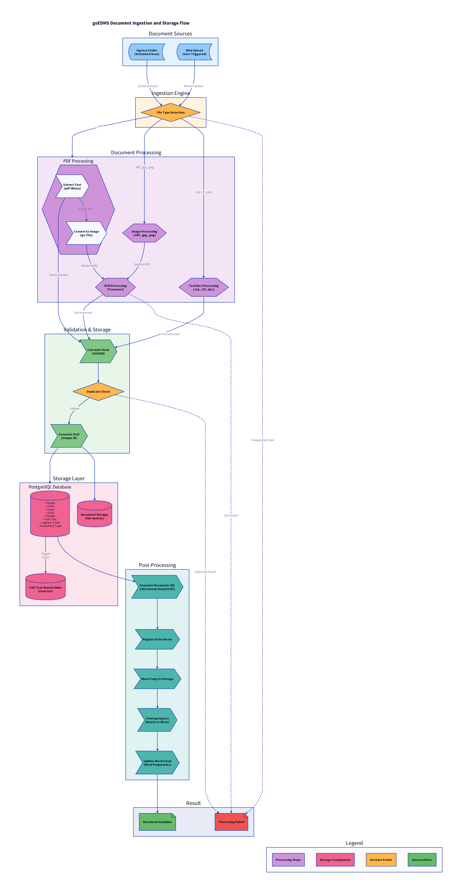

[](https://gitter.im/goEDMS/community) [](https://goreportcard.com/report/github.com/deranjer/goEDMS)

# goEDMS

A lightweight Electronic Document Management System (EDMS) for home users, built entirely in Go. It has no
user authentication.

**Originally created by [deranjer/goEDMS](https://github.com/deranjer/goEDMS)** - This is a hard fork with significant modernization and new features.

## What is goEDMS?

goEDMS is a self-hosted document management system designed for home users to scan, organize, and search receipts, documents, and other files. The focus is on **simplicity, speed, and reliability** rather than enterprise-grade feature complexity.

### Key Design Principles
- **Easy Setup**: Works out-of-the-box with ephemeral database for testing
- **Pure Go**: No external dependencies except PostgreSQL and optional Tesseract OCR
- **Modern Stack**: Go 1.22+, WebAssembly frontend, PostgreSQL full-text search
- **Self-Contained**: WebAssembly frontend embedded in the binary

### Major Improvements in This Fork
- ✨ Go 1.22+ with structured logging (slog)
- ✨ WebAssembly frontend using go-app (replaced React)
- ✨ Pure Go image processing (removed ImageMagick dependency)
- ✨ PostgreSQL full-text search with word cloud visualization
- ✨ Step-based ingestion wiDeploy to gokrazy with local dbth comprehensive job tracking
- ✨ Database-stored configuration (removed TOML files)
- ✨ Graceful OCR failure handling

## Roadmap

### Current Features
- [x] WebAssembly frontend using go-app framework
- [x] Full-text search with PostgreSQL tsvector
- [x] Word cloud visualization
- [x] Document viewer with print support
- [x] Step-based ingestion with job tracking
- [x] OCR support with Tesseract
- [x] Duplicate detection (MD5 hashing)
- [x] Multiple file format support (PDF, images, text)

### Planned Features
- [ ] Deploy to gokrazy with remote db
- [ ] Deploy to gokrazy with local db
- [ ] Backup system
- [ ] Thumbnails
- [ ] Working job system display
- [ ] Backup and restore functionality
- [ ] Document tagging system
- [ ] Advanced workflows (inbox, categorization, importance)
- [ ] AI-powered document summaries
- [ ] Document archival system


## ConfigurationDeploy to gokrazy with local db

goEDMS supports multiple ways to configure the application:

### 1. Development Mode (Ephemeral PostgreSQL)

The easiest way to get started for development:

```bash
DATABASE_TYPE=ephemeral ./goEDMS
```

This starts goEDMS with an ephemeral PostgreSQL database that is automatically created and destroyed when the application exits. Perfect for testing and development!

### 2. Local PostgreSQL with .env File (Recommended)

For production use with a persistent PostgreSQL database:

1. **Install and start PostgreSQL** (if not already running)
   ```bash
   # On Ubuntu/Debian
   sudo apt install postgresql
   sudo systemctl start postgresql

   # On macOS with Homebrew
   brew install postgresql
   brew services start postgresql
   ```

2. **Create a database and user**
   ```bash
   sudo -u postgres psql
   CREATE DATABASE goedms;
   CREATE USER goedms WITH PASSWORD 'your_password';
   GRANT ALL PRIVILEGES ON DATABASE goedms TO goedms;
   \q
   ```

3. **Copy and configure .env file**
   ```bash
   cp .env.example .env
   ```

4. **Edit .env** with your database credentials:
   ```bash
   GOEDMS_DATABASE_TYPE=postgres
   GOEDMS_DATABASE_HOST=localhost
   GOEDMS_DATABASE_PORT=5432
   GOEDMS_DATABASE_NAME=goedms
   GOEDMS_DATABASE_USER=goedms
   GOEDMS_DATABASE_PASSWORD=your_password
   GOEDMS_DATABASE_SSLMODE=dDeploy to gokrazy with local dbisable
   ```

5. **Run goEDMS**
   ```bash
   ./goEDMS
   ```

### Configuration Storage

**All application settings are stored in the PostgreSQL database**, not in configuration files. After the initial database connection, you can configure all other settings (ingress paths, document storage, OCR settings, etc.) through the web interface or database directly.

### Configuration Priority

Database connection settings are loaded in this order (later overrides earlier):

1. `.env` file (if present)
2. Environment variables (highest priority)

### Environment Variables

Database connection options can be set via environment variables:

- `DATABASE_TYPE` - Database type (postgres, ephemeral, sqlite, cockroachdb)
- `DATABASE_HOST` - Database hostname (not needed for ephemeral)
- `DATABASE_PORT` - Database port (not needed for ephemeral)
- `DATABASE_NAME` - Database name (not needed for ephemeral)
- `DATABASE_USER` - Database username (not needed for ephemeral)
- `DATABASE_PASSWORD` - Database password (not needed for ephemeral)
- `DATABASE_SSLMODE` - SSL mode (disable, require, etc.)

See `.env.example` for a complete list of available variables.

## Architecture

### Document Ingestion Flow

goEDMS processes documents through a 3-step ingestion pipeline with comprehensive job tracking:



**Step-Based Processing:**
1. **Hash & Deduplicate** - Calculate MD5 hash and check for duplicates
2. **Move & Verify** - Move file to documents folder and verify hash integrity
3. **Extract & Index** - Extract text via OCR/PDF parsing and update search index

**Key Features:**
- **Multiple Sources**: Documents can be added via scheduled ingress folder scans or direct web uploads
- **Format Support**: PDF, images (TIFF, JPG, PNG), text files (TXT, RTF)
- **Intelligent Processing**:
  - PDF text extraction with automatic fallback to OCR for scanned documents
  - Image-to-text conversion using Tesseract OCR
  - Graceful handling of documents without extractable text (e.g., handwritten notes)
- **Deduplication**: MD5 hash-based duplicate detection before processing
- **Full-Text Search**: Automatic indexing in PostgreSQL using tsvector for fast full-text search
- **Word Cloud**: Automatic word frequency analysis for document visualization
- **Job Tracking**: Real-time progress tracking with per-file step reporting
- **Storage**: Secure file system storage with database metadata tracking

For more details, see:
- [Ingestion Flow Diagram Source](docs/ingestion-flow.d2) - D2 diagram source
- [Ingestion Refactor Documentation](docs/INGESTION_REFACTOR.md) - Step-based ingestion details
- [Architecture Documentation](docs/ARCHITECTURE.md) - Frontend/Backend separation details
- [OpenAPI Specification](docs/openapi.yaml) - Complete API documentation

## Documentation

[Documentation](https://deranjer.github.io/goEDMSDocs)


## Commands

Main Tasks (using [Task](https://taskfile.dev)):

**Development:**Deploy to gokrazy with local db
- `task dev` - Run the backend application locally (serves WASM frontend)

**Testing:**
- `task test` - Run all Go tests
- `task test:coverage` - Run tests with coverage report (generates HTML)
- `task test:race` - Run tests with race detector

**Building:**
- `task build` - Build both WASM frontend and backend
- `task build:wasm` - Build only the WebAssembly frontend
- `task build:backend` - Build only the backend

**Alternative Build:**
- `./build-wasm.sh` - Build WASM frontend with version embedding (alternative to task)

**API Documentation:**
- `task openapi` - Generate OpenAPI specification from code annotations

**Code Quality:**
- `task fmt` - Format Go code
- `task vet` - Run go vet
- `task check` - Run fmt, vet, and tests
Deploy to gokrazy with local db
**Cleanup:**
- `task clean` - Remove build artifacts

**Docker:**
- `task docker:build` - Build Docker image
- `task docker:run` - Run Docker container

## Quick Start

### Prerequisites
- Go 1.22 or later
- PostgreSQL (for production) or use ephemeral database for testing
- [Task](https://taskfile.dev/installation/) (optional, for build automation)
- Tesseract OCR (optional, for document OCR)

### Running goEDMS

**Development Mode (Ephemeral Database):**
```bash
DATABASE_TYPE=ephemeral ./goEDMS
```
Open [http://localhost:3000](http://localhost:3000) in your browser.

**Production Mode:**
```bash
# Configure .env file (see Configuration section)
cp .env.example .env
# Edit .env with your database credentials
./goEDMS
```

### Building from Source

```bash
# Install Task (optional)
# See: https://taskfile.dev/installation/

# Build everything
task build

# Or build WASM frontend separately
task build:wasm
# Or use the build script
./build-wasm.sh

# Build backend
task build:backend
```

### Running Tests

```bash
# All tests
task test

# Specific test suites
go test -v -run TestSearch              # Search functionality
go test -v -run TestSearchEndpoint      # API endpoints
go test -v ./webapp -run TestSearch     # Frontend tests
go test -v -run TestSearchPerformance   # Performance tests
```

### Performance

On a representative sample of docs on my laptop is running an ingestion speed about 4 seconds per document.


## Technology Stack

- **Backend**: Go 1.22+ with Echo framework
- **Frontend**: Go WebAssembly using [go-app](https://go-app.dev/) framework
- **Database**: PostgreSQL with full-text search (tsvector)
- **OCR**: Tesseract for image and scanned PDF processing
- **PDF Processing**: Native Go libraries
- **Job Tracking**: ULID-based job system with real-time progress


## Deployment

I am currently trialling deployment to a gokrazy instance with https://github.com/drummonds/gokrazy-goEDMS.  

## TODO

- [ ] Retest docker deployment after config file change